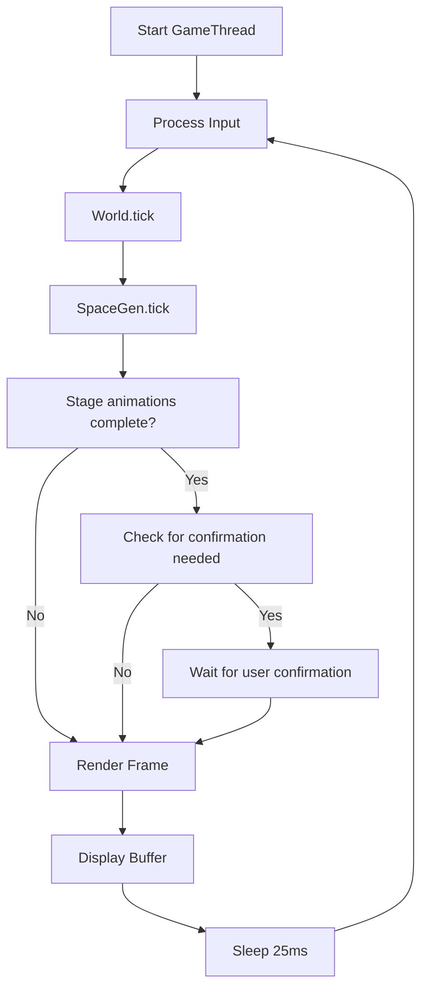
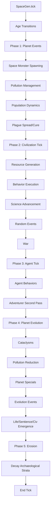
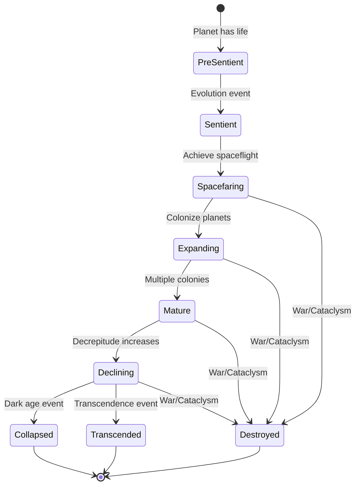
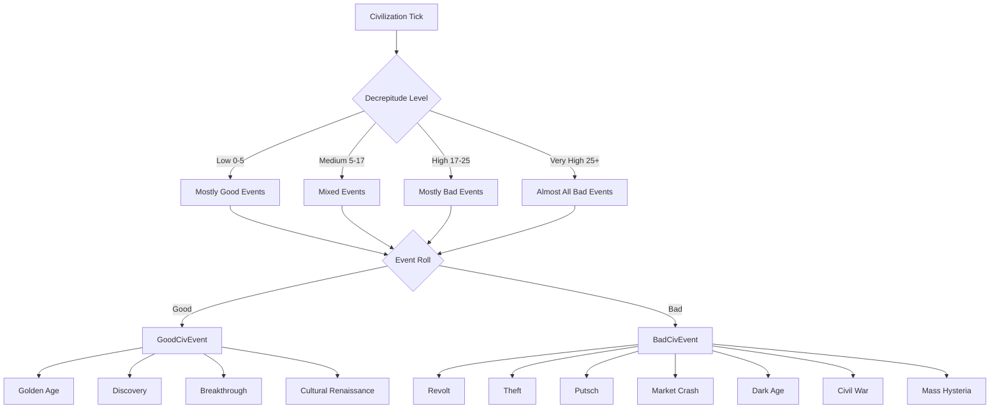
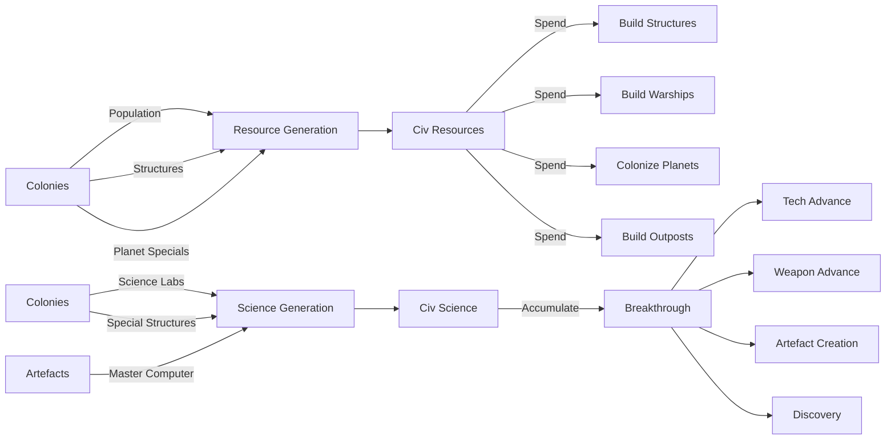
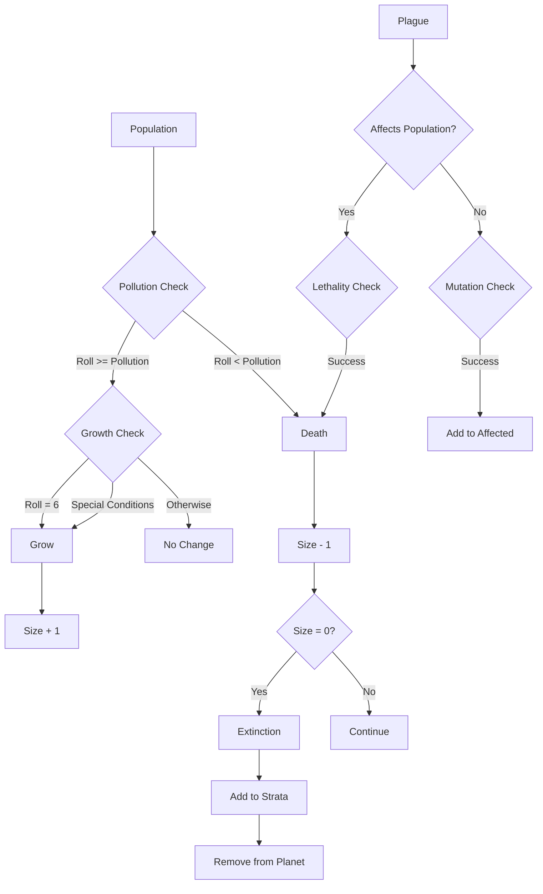
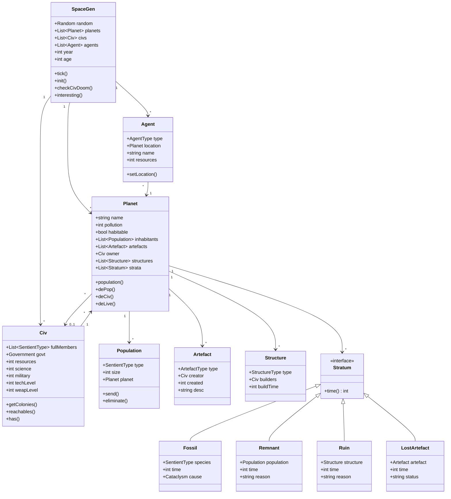

# SpaceGen - Detailed Design Analysis

## Executive Summary

SpaceGen is a procedural space civilization simulator that generates emergent narratives about the rise and fall of civilizations across multiple planets. The system uses a tick-based simulation engine with an animation/rendering layer to visualize events as they unfold.

**Core Concept**: A turn-based procedural generator that simulates:
- Planet formation and evolution
- Life emergence and sentient species development
- Civilization rise, expansion, conflict, and collapse
- Archaeological layers (strata) preserving history
- Agents (monsters, adventurers, pirates) affecting the world

---

## Architecture Overview

### High-Level System Architecture

```
┌─────────────────────────────────────────────────────────────┐
│                         Main Entry                           │
│  - Initializes JFrame, Canvas, BufferStrategy               │
│  - Creates GameWorld, GameDisplay, Input, GameControls      │
│  - Spawns GameThread                                         │
└────────────────────┬────────────────────────────────────────┘
                     │
                     ▼
┌─────────────────────────────────────────────────────────────┐
│                      GameThread                              │
│  - Main game loop (40 FPS - 25ms sleep)                     │
│  - Processes input → tick world → render → display          │
│  - Has subRun() for animation sequences                     │
└────────────────────┬────────────────────────────────────────┘
                     │
                     ▼
┌─────────────────────────────────────────────────────────────┐
│                      GameWorld                               │
│  - Contains SpaceGen instance                                │
│  - Contains Stage (animation system)                         │
│  - Manages confirmation flow and autorun mode                │
└────────────────────┬────────────────────────────────────────┘
                     │
        ┌────────────┴────────────┐
        ▼                         ▼
┌──────────────────┐      ┌──────────────────┐
│    SpaceGen      │      │      Stage       │
│  (Core Logic)    │      │  (Animation)     │
└──────────────────┘      └──────────────────┘
```

---

## Core Components

### 1. SpaceGen (Core Simulation Engine)

**Purpose**: The heart of the simulation - manages all game entities and executes turn-based logic.

**Key Responsibilities**:
- Planet generation and lifecycle
- Civilization creation and management
- Population dynamics
- Event generation (good/bad events, cataclysms)
- Agent behavior (monsters, adventurers, pirates)
- War and diplomacy
- Archaeological strata accumulation

**State**:
```go
type SpaceGen struct {
    random          *Random
    log             []string
    planets         []*Planet
    civs            []*Civ
    agents          []*Agent
    historicalCivNames      []string
    historicalSentientNames []string
    turnLog         []string
    year            int
    age             int
    hadCivs         bool
    yearAnnounced   bool
}
```

**Core Algorithm** (tick method):
```go
func (sg *SpaceGen) Tick() {
    sg.year++
    sg.yearAnnounced = false
    
    // Age transitions
    if !sg.hadCivs && len(sg.civs) > 0 {
        sg.announceAge("CIVILISATION")
    }
    if sg.hadCivs && len(sg.civs) == 0 {
        sg.age++
        sg.announceAge("DARKNESS")
    }
    sg.hadCivs = len(sg.civs) > 0
    
    // Phase 1: Planet Events
    for planet := range sg.planets {
        // Space monster spawning (1/2500 chance)
        if sg.probability(2500) {
            sg.spawnSpaceMonster(planet)
        }
        
        // Pollution management
        if planet.population > 12 || (planet.population > 7 && sg.probability(10)) {
            planet.pollution++
        }
        
        // Population dynamics
        for pop := range planet.inhabitants {
            // Mutation (1/100 chance if no owner)
            if planet.owner == nil && sg.probability(100) {
                pop.mutate()
            }
            
            // Pollution deaths vs growth
            roll := sg.dice(6)
            if roll < planet.pollution {
                pop.size--
                planet.pollution--
                if pop.size == 0 {
                    planet.removePop(pop)
                }
            } else {
                // Growth conditions
                if roll == 6 || specialGrowthConditions(pop, planet) {
                    pop.size++
                }
            }
            
            // Plague effects
            for plague := range planet.plagues {
                if plague.affects(pop.type) {
                    if sg.dice(12) < plague.lethality {
                        pop.size--
                    }
                } else if sg.dice(12) < plague.mutationRate {
                    plague.affects.add(pop.type)
                }
            }
        }
        
        // Plague spread and curing
        for plague := range planet.plagues {
            if sg.dice(12) < plague.curability {
                planet.removePlague(plague)
            } else if sg.dice(12) < plague.transmissivity {
                sg.spreadPlague(plague, planet)
            }
        }
    }
    
    // Phase 2: Civilization Tick
    for civ := range sg.civs {
        if sg.checkCivDoom(civ) {
            sg.removeCiv(civ)
            continue
        }
        
        // Resource and science generation
        newRes := 0
        newSci := 1
        for colony := range civ.colonies {
            // Special artefact effects
            if civ.has(UNIVERSAL_ANTIDOTE) {
                colony.clearPlagues()
            }
            
            // Pollution from overcrowding
            if colony.population > 7 {
                colony.pollution++
            }
            
            // Population redistribution
            if sg.probability(6) {
                sg.redistributePopulation(civ, colony)
            }
            
            // Resource calculation
            if colony.population > 0 {
                newRes++
                if colony.hasLifeform(VAST_HERDS) {
                    newRes++
                }
            }
            if colony.hasSpecial(GEM_WORLD) {
                newRes++
            }
            if colony.hasStructure(MINING_BASE) {
                newRes++
            }
            if colony.hasStructure(SCIENCE_LAB) {
                newSci += 2
            }
        }
        
        civ.resources += newRes
        
        // Behavior execution
        leadSpecies := sg.pick(civ.fullMembers)
        sg.executeBehavior(leadSpecies.base.behavior, civ)
        sg.executeBehavior(civ.govt.behavior, civ)
        
        civ.science += newSci
        
        // Scientific breakthroughs
        if civ.science > civ.nextBreakthrough {
            civ.science -= civ.nextBreakthrough
            if sg.scienceAdvance(civ) {
                continue
            }
            civ.nextBreakthrough = min(500, civ.nextBreakthrough * 3 / 2)
        }
        
        // Decrepitude (aging civilization)
        civAge := sg.year - civ.birthYear
        if civAge > 5  { civ.decrepitude++ }
        if civAge > 15 { civ.decrepitude++ }
        if civAge > 25 { civ.decrepitude++ }
        if civAge > 40 { civ.decrepitude++ }
        if civAge > 60 { civ.decrepitude++ }
        
        // Random events (3% chance)
        if sg.probability(3) {
            eventRoll := sg.dice(6)
            
            // Event probability based on decrepitude
            good, bad := sg.calculateEventProbability(civ.decrepitude, eventRoll)
            
            if good {
                sg.executeGoodEvent(civ)
            }
            if bad {
                sg.executeBadEvent(civ)
            }
        }
        
        // War
        sg.doWar(civ)
    }
    
    // Phase 3: Agent Tick
    for agent := range sg.agents {
        agent.type.behave(agent, sg)
    }
    // Second pass for adventurers
    for agent := range sg.agents {
        if agent.type == ADVENTURER {
            agent.type.behave(agent, sg)
        }
    }
    
    // Phase 4: Planet Evolution & Cataclysms
    for planet := range sg.planets {
        // Cataclysm (1/500 chance)
        if planet.habitable && sg.probability(500) {
            cataclysm := sg.pick(CATACLYSMS)
            planet.deLive(cataclysm)
            continue
        }
        
        // Pollution reduction
        if sg.probability(200) && planet.pollution > 1 {
            planet.pollution--
        }
        
        // Planet special features
        if sg.probability(300 + 5000 * len(planet.specials)) {
            special := sg.pick(PLANET_SPECIALS)
            if !planet.hasSpecial(special) {
                planet.addSpecial(special)
            }
        }
        
        // Evolution
        planet.evoPoints += sg.dice(6)^5 * 3 * (6 - planet.pollution)
        if planet.evoPoints > planet.evoNeeded && sg.probability(12) {
            planet.evoPoints = 0
            
            if !planet.habitable {
                planet.habitable = true
            } else {
                if len(planet.inhabitants) > 0 && sg.coin() {
                    if planet.owner == nil {
                        // Civilization emergence
                        govt := sg.pick(GOVERNMENTS)
                        starter := sg.pick(planet.inhabitants)
                        starter.size++
                        civ := NewCiv(sg.year, starter.type, planet, govt)
                        sg.civs.add(civ)
                    }
                } else {
                    if sg.probability(3) || len(planet.lifeforms) >= 3 {
                        // Sentient species emergence
                        sentient := sg.inventSentientType(planet)
                        planet.addPopulation(sentient, 2 + sg.dice(1))
                    } else {
                        // Special lifeform
                        lifeform := sg.pick(SPECIAL_LIFEFORMS)
                        if !planet.hasLifeform(lifeform) {
                            planet.addLifeform(lifeform)
                        }
                    }
                }
            }
        }
    }
    
    // Phase 5: Erosion (Archaeological decay)
    for planet := range sg.planets {
        for stratum := range planet.strata {
            age := sg.year - stratum.time + 1
            
            switch stratum.type {
            case FOSSIL:
                if sg.probability(12000/age + 800) {
                    planet.removeStratum(stratum)
                }
            case LOST_ARTEFACT:
                if stratum.artefact.type != STASIS_CAPSULE {
                    if sg.probability(10000/age + 500) {
                        planet.removeStratum(stratum)
                    }
                }
            case REMNANT:
                if sg.probability(4000/age + 400) {
                    planet.removeStratum(stratum)
                }
            case RUIN:
                decayRate := sg.getRuinDecayRate(stratum.structure.type)
                if sg.probability(decayRate/age + baseRate) {
                    planet.removeStratum(stratum)
                }
            }
        }
    }
}
```

---

### 2. Planet System

**Purpose**: Represents celestial bodies that can host life, civilizations, and accumulate history.

**Data Model**:
```go
type Planet struct {
    name          string
    pollution     int
    habitable     bool
    evoPoints     int
    evoNeeded     int
    specials      []PlanetSpecial
    lifeforms     []SpecialLifeform
    inhabitants   []*Population
    artefacts     []*Artefact
    owner         *Civ
    structures    []*Structure
    plagues       []*Plague
    strata        []Stratum  // Archaeological layers
    x, y          int
    sprite        *PlanetSprite
}

type Population struct {
    type    *SentientType
    size    int
    planet  *Planet
    sprite  *Sprite
}

type Stratum interface {
    Time() int
}

type Fossil struct {
    species  *SentientType
    time     int
    cause    *Cataclysm
}

type Remnant struct {
    population *Population
    time       int
    cause      *Cataclysm
    reason     string
    plague     *Plague
}

type Ruin struct {
    structure *Structure
    time      int
    cause     *Cataclysm
    reason    string
}

type LostArtefact struct {
    status    string  // "lost", "hidden", "buried"
    time      int
    artefact  *Artefact
}
```

**Key Operations**:
```go
func (p *Planet) Population() int {
    sum := 0
    for pop := range p.inhabitants {
        sum += pop.size
    }
    return sum
}

func (p *Planet) DePop(pop *Population, time int, cat *Cataclysm, reason string) {
    // Add to archaeological record
    p.strata.add(NewRemnant(pop, time, cat, reason))
    pop.eliminate()
    
    // Remove plagues that no longer have hosts
    for plague := range p.plagues {
        hasHost := false
        for otherPop := range p.inhabitants {
            if plague.affects(otherPop.type) {
                hasHost = true
                break
            }
        }
        if !hasHost {
            p.removePlague(plague)
        }
    }
}

func (p *Planet) DeCiv(time int, cat *Cataclysm, reason string) {
    // Dark age - civilization collapses
    for structure := range p.structures {
        p.strata.add(NewRuin(structure, time, reason))
    }
    p.clearStructures()
    
    for artefact := range p.artefacts {
        p.strata.add(NewLostArtefact("lost", time, artefact))
    }
    p.clearArtefacts()
    
    p.owner = nil
}

func (p *Planet) DeLive(time int, cat *Cataclysm) {
    // Complete extinction event
    for pop := range p.inhabitants {
        p.strata.add(NewFossil(pop.type, time, cat))
        pop.eliminate()
    }
    p.inhabitants = []
    p.habitable = false
    
    for lifeform := range p.lifeforms {
        p.removeLifeform(lifeform)
    }
}
```

---

### 3. Civilization System

**Purpose**: Manages spacefaring civilizations with government, resources, technology, and behavior.

**Data Model**:
```go
type Civ struct {
    fullMembers      []*SentientType
    govt             Government
    relations        map[*Civ]DiplomacyOutcome
    resources        int
    science          int
    military         int
    weapLevel        int
    techLevel        int
    name             string
    birthYear        int
    nextBreakthrough int
    decrepitude      int
    sprites          []*CivSprite
    sg               *SpaceGen
}

type Government int
const (
    DICTATORSHIP Government = iota
    THEOCRACY
    FEUDAL_STATE
    REPUBLIC
)

type GovernmentData struct {
    typeName          string
    title             string
    bombardProbability int
    encounterOutcomes []SentientEncounterOutcome
    behavior          []CivAction
}
```

**Key Operations**:
```go
func (c *Civ) GetColonies() []*Planet {
    colonies := []*Planet{}
    for planet := range c.sg.planets {
        if planet.owner == c {
            colonies.add(planet)
        }
    }
    return colonies
}

func (c *Civ) FullColonies() []*Planet {
    colonies := []*Planet{}
    for colony := range c.GetColonies() {
        if colony.Population() > 0 {
            colonies.add(colony)
        }
    }
    return colonies
}

func (c *Civ) Reachables(sg *SpaceGen) []*Planet {
    range := 3 + c.techLevel * c.techLevel
    if c.has(TELEPORT_GATE) {
        range = 10000
    }
    
    reachable := []*Planet{}
    for planet := range sg.planets {
        closestDist := INFINITY
        for colony := range c.GetColonies() {
            dist := distanceSquared(planet, colony)
            closestDist = min(closestDist, dist)
        }
        if closestDist <= range {
            reachable.add(planet)
        }
    }
    return reachable
}

func (c *Civ) Has(artefactType ArtefactType) bool {
    for colony := range c.GetColonies() {
        for artefact := range colony.artefacts {
            if artefact.type == artefactType {
                return true
            }
        }
    }
    return false
}
```

---

### 4. Agent System

**Purpose**: Represents independent actors (space monsters, adventurers, pirates) that affect the world.

**Data Model**:
```go
type Agent struct {
    location   *Planet
    type       AgentType
    resources  int
    fleet      int
    birth      int
    name       string
    st         *SentientType
    originator *Civ
    timer      int
    target     *Planet
    color      string
    sprite     *Sprite
    sg         *SpaceGen
    mType      string  // Monster type
}

type AgentType int
const (
    SPACE_MONSTER AgentType = iota
    PIRATE
    ADVENTURER
    REFUGEE
    MERCHANT
)
```

**Behavior Patterns**:
```go
func (at AgentType) Behave(agent *Agent, sg *SpaceGen) {
    switch at {
    case SPACE_MONSTER:
        // Attack inhabited planets
        if agent.location.Population() > 0 {
            if sg.probability(3) {
                sg.monsterAttack(agent)
            }
        } else {
            // Move to random planet
            agent.setLocation(sg.pick(sg.planets))
        }
        
    case PIRATE:
        // Raid civilizations
        if agent.location.owner != nil {
            if sg.probability(4) {
                sg.pirateRaid(agent)
            }
        }
        // Move towards wealthy targets
        agent.seekTarget(sg)
        
    case ADVENTURER:
        // Explore and discover artefacts
        if len(agent.location.strata) > 0 {
            if sg.probability(5) {
                sg.adventurerDiscover(agent)
            }
        }
        agent.wander(sg)
        
    case REFUGEE:
        // Seek safe haven
        agent.seekSafePlanet(sg)
        
    case MERCHANT:
        // Trade between civilizations
        agent.trade(sg)
    }
}
```

---

### 5. Animation System (Stage)

**Purpose**: Manages visual animations and camera tracking for events.

**Data Model**:
```go
type Stage struct {
    doTrack    bool
    sprites    []*Sprite
    animations []Animation
    camX, camY int
}

type Animation interface {
    Tick(stage *Stage) bool  // Returns true when complete
}

type Sprite struct {
    x, y       int
    img        Image
    children   []*Sprite
    parent     *Sprite
    highlight  bool
    flash      bool
}
```

**Animation Types**:
```go
type Delay struct {
    wait      int
    animation Animation
}

type Tracking struct {
    sprite    *Sprite
    animation Animation
    tick      int
    time      int
    sx, sy    int
    lock      bool
}

type Move struct {
    sprite       *Sprite
    sx, sy       int  // Start position
    tx, ty       int  // Target position
    time         int
    tick         int
}

type Add struct {
    sprite *Sprite
    parent *Sprite
    tick   int
}

type Remove struct {
    sprite *Sprite
    tick   int
}

type Seq struct {
    animations []Animation
    index      int
}

type Sim struct {
    animations []Animation  // Simultaneous
}
```

**Animation Flow**:
```go
func (s *Stage) Tick() bool {
    allComplete := true
    for animation := range s.animations {
        if !animation.Tick(s) {
            allComplete = false
        }
    }
    if allComplete {
        s.animations = []
    }
    return allComplete
}

func (t *Tracking) Tick(stage *Stage) bool {
    if !stage.doTrack {
        return t.animation.Tick(stage)
    }
    
    targetX := t.sprite.globalX() + t.sprite.img.width / 2
    targetY := t.sprite.globalY() + t.sprite.img.height / 2
    
    if t.tick == 0 {
        t.sx = stage.camX
        t.sy = stage.camY
        distance := sqrt((t.sx - targetX)^2 + (t.sy - targetY)^2)
        t.time = int(distance / 120) + 3
    }
    
    if !t.lock {
        // Interpolate camera position
        stage.camX = t.sx + (targetX - t.sx) * t.tick / t.time
        stage.camY = t.sy + (targetY - t.sy) * t.tick / t.time
        t.tick++
        t.lock = t.tick > t.time
        return false
    } else {
        stage.camX = targetX
        stage.camY = targetY
        return t.animation.Tick(stage)
    }
}
```

---

## System Flow Diagrams

### Main Game Loop



### SpaceGen Tick Phases



### Civilization Lifecycle



### Event System Architecture



---

## Key Algorithms

### 1. Civilization Doom Check

```go
func (sg *SpaceGen) CheckCivDoom(civ *Civ) bool {
    // No full colonies = collapse
    if len(civ.FullColonies()) == 0 {
        sg.log("The " + civ.name + " collapses.")
        for colony := range civ.GetColonies() {
            colony.DeCiv(sg.year, nil, "during the collapse of the " + civ.name)
        }
        return true
    }
    
    // Single colony with 1 population = remnant
    if len(civ.GetColonies()) == 1 && civ.GetColonies()[0].Population() == 1 {
        remnant := civ.GetColonies()[0]
        sg.log("The " + civ.name + " collapses, leaving only survivors on " + remnant.name)
        remnant.owner = nil
        return true
    }
    
    return false
}
```

### 2. War System

```go
func DoWar(attacker *Civ, sg *SpaceGen) {
    // Find enemies
    enemies := []*Civ{}
    for civ := range sg.civs {
        if attacker.relation(civ) == WAR {
            enemies.add(civ)
        }
    }
    
    if len(enemies) == 0 {
        return
    }
    
    defender := sg.pick(enemies)
    
    // Calculate military strength
    attackerStr := attacker.military + attacker.weapLevel * 2
    defenderStr := defender.military + defender.weapLevel * 2
    
    // Attacker needs resources to wage war
    if attacker.resources < 2 {
        return
    }
    attacker.resources -= 2
    
    // Find target
    reachable := attacker.Reachables(sg)
    targets := []*Planet{}
    for planet := range reachable {
        if planet.owner == defender {
            targets.add(planet)
        }
    }
    
    if len(targets) == 0 {
        // Peace if no targets reachable
        attacker.relations[defender] = PEACE
        defender.relations[attacker] = PEACE
        sg.log("The " + attacker.name + " and " + defender.name + " make peace.")
        return
    }
    
    target := sg.pick(targets)
    
    // Battle resolution
    if attackerStr > defenderStr {
        // Attacker wins
        if sg.dice(attacker.govt.bombardProbability) == 0 {
            // Bombardment
            sg.log("The " + attacker.name + " bombards " + target.name)
            target.pollution += 3
            for pop := range target.inhabitants {
                if pop.size > 1 {
                    pop.size--
                }
            }
        } else {
            // Invasion
            sg.log("The " + attacker.name + " invades " + target.name)
            
            // Determine fate of inhabitants
            for pop := range target.inhabitants {
                outcome := sg.pick(attacker.govt.encounterOutcomes)
                switch outcome {
                case EXTERMINATE:
                    target.DePop(pop, sg.year, nil, "exterminated by " + attacker.name)
                case SUBJUGATE:
                    // Population becomes subjugated
                    pop.addUpdateImgs()
                case GIVE_FULL_MEMBERSHIP:
                    if !attacker.fullMembers.contains(pop.type) {
                        attacker.fullMembers.add(pop.type)
                    }
                    pop.addUpdateImgs()
                case IGNORE:
                    // Leave them alone
                }
            }
            
            target.owner = attacker
        }
        
        // Casualties
        attacker.military--
        defender.military -= 2
    } else {
        // Defender wins
        sg.log("The " + defender.name + " repels an attack by " + attacker.name)
        attacker.military -= 2
        defender.military--
    }
    
    // Check for doom
    sg.CheckCivDoom(attacker)
    sg.CheckCivDoom(defender)
}
```

### 3. Science Advancement

```go
func Advance(civ *Civ, sg *SpaceGen) bool {
    roll := sg.dice(20)
    
    switch roll {
    case 0, 1, 2:
        // Tech level increase
        civ.techLevel++
        sg.log("The " + civ.name + " advances to tech level " + civ.techLevel)
        
    case 3, 4:
        // Weapon level increase
        civ.weapLevel++
        sg.log("The " + civ.name + " develops more advanced weapons")
        
    case 5, 6, 7:
        // Discover artefact in strata
        colonies := civ.GetColonies()
        for colony := range colonies {
            for stratum := range colony.strata {
                if lostArt, ok := stratum.(*LostArtefact); ok {
                    colony.strata.remove(stratum)
                    colony.addArtefact(lostArt.artefact)
                    sg.log("The " + civ.name + " discovers " + lostArt.artefact)
                    return false
                }
            }
        }
        
    case 8, 9:
        // Create artefact
        device := sg.pick(ARTEFACT_DEVICES)
        artefact := NewArtefact(sg.year, civ, device, device.getName())
        colony := civ.largestColony()
        colony.addArtefact(artefact)
        sg.log("The " + civ.name + " creates " + artefact)
        
    case 10:
        // Transcendence
        sg.log("The " + civ.name + " transcends physical reality!")
        for colony := range civ.GetColonies() {
            colony.transcend(sg.year)
        }
        return true  // Civ removed
        
    default:
        // Minor breakthrough
        sg.log("The " + civ.name + " makes a minor scientific breakthrough")
    }
    
    return false
}
```

### 4. Interesting World Detection

```go
func (sg *SpaceGen) Interesting(bound int) bool {
    points := 0
    
    // Civilizations are very valuable
    points += len(sg.civs) * 100
    
    // Age adds points
    points += sg.year / 6
    
    // Planet features
    for planet := range sg.planets {
        points += len(planet.lifeforms) * 5
        points += len(planet.specials) * 15
        points += planet.Population()
        
        // Archaeological finds
        for stratum := range planet.strata {
            switch s := stratum.(type) {
            case *LostArtefact:
                switch s.artefact.type {
                case WRECK:
                    points += 20
                case PIRATE_HOARD:
                    points += 15
                case TIME_ICE:
                    points += 10
                default:
                    points += 5
                }
            }
        }
        
        points += len(planet.plagues) * 15
    }
    
    // Agents
    points += len(sg.agents) * 25
    
    return sg.year > bound/4 && points > bound
}
```

---

## Data Flow Diagrams

### Resource Flow in Civilizations



### Population Dynamics



---

## Class Relationships



---

## Enumerations and Constants

### Government Types

```go
type Government struct {
    TypeName          string
    Title             string
    BombardP          int
    EncounterOutcomes []SentientEncounterOutcome
    Behavior          []CivAction
}

var GOVERNMENTS = []Government{
    {
        TypeName: "Military Dictatorship",
        Title: "Empire",
        BombardP: 2,
        EncounterOutcomes: []SentientEncounterOutcome{
            EXTERMINATE, EXTERMINATE, EXTERMINATE_FAIL,
            IGNORE, IGNORE, IGNORE, IGNORE,
            SUBJUGATE, SUBJUGATE, SUBJUGATE, SUBJUGATE,
        },
        Behavior: []CivAction{
            EXPLORE_PLANET, COLONISE_PLANET,
            BUILD_MILITARY_BASE, BUILD_MILITARY_BASE,
            BUILD_WARSHIPS, BUILD_WARSHIPS, BUILD_WARSHIPS,
            DO_RESEARCH, BUILD_CONSTRUCTION,
        },
    },
    {
        TypeName: "Theocracy",
        Title: "Church",
        BombardP: 4,
        // ... similar structure
    },
    {
        TypeName: "Feudal State",
        Title: "Kingdom",
        BombardP: 2,
        // ... similar structure
    },
    {
        TypeName: "Republic",
        Title: "Republic",
        BombardP: 1,
        EncounterOutcomes: []SentientEncounterOutcome{
            EXTERMINATE, EXTERMINATE, EXTERMINATE_FAIL,
            IGNORE, IGNORE, IGNORE, IGNORE,
            SUBJUGATE, SUBJUGATE,
            GIVE_FULL_MEMBERSHIP, GIVE_FULL_MEMBERSHIP,
            GIVE_FULL_MEMBERSHIP, GIVE_FULL_MEMBERSHIP,
            GIVE_FULL_MEMBERSHIP, GIVE_FULL_MEMBERSHIP,
        },
        // ... similar structure
    },
}
```

### Cataclysm Types

```go
type Cataclysm struct {
    Name string
    Desc string
}

var CATACLYSMS = []Cataclysm{
    {"nova", "The star of $name goes nova, scraping the planet clean!"},
    {"volcanic eruptions", "Massive volcanic eruptions eradicate all life!"},
    {"axial shift", "A shift in orbital axis spells doom for all life!"},
    {"asteroid impact", "All life is killed by a massive asteroid impact!"},
    {"nanofungal bloom", "A nanofungal bloom consumes all other life!"},
    {"psionic shockwave", "A psionic shockwave instantly stops all life!"},
}
```

### Artefact Types

```go
type ArtefactType int

const (
    // Regular artefacts
    WRECK ArtefactType = iota
    PIRATE_HOARD
    TIME_ICE
    ART
    
    // Devices (functional)
    MASTER_COMPUTER
    MIND_CONTROL_DEVICE
    VIRTUAL_REALITY_MATRIX
    PLANET_DESTROYER
    TELEPORT_GATE
    UNIVERSAL_ANTIDOTE
    MIND_READER
    STASIS_CAPSULE
)
```

---

## Probability and Randomness

The system uses several probability mechanisms:

### 1. Dice Rolls
```go
func (sg *SpaceGen) dice(n int) int {
    return sg.random.nextInt(n)
}

func (sg *SpaceGen) diceMultiple(rolls, sides int) int {
    sum := 0
    for i := 0; i < rolls; i++ {
        sum += sg.dice(sides)
    }
    return sum
}
```

### 2. Probability Checks
```go
func (sg *SpaceGen) probability(n int) bool {
    return sg.dice(n) == 0  // 1 in n chance
}

func (sg *SpaceGen) coin() bool {
    return sg.random.nextBoolean()
}
```

### 3. Random Selection
```go
func (sg *SpaceGen) pick(items []T) T {
    return items[sg.random.nextInt(len(items))]
}
```

### Key Probabilities

| Event | Probability | Per Tick |
|-------|-------------|----------|
| Space Monster Spawn | 1/2500 | Per planet |
| Population Mutation | 1/100 | Per pop (if no owner) |
| Civ Random Event | 3/100 | Per civ |
| Cataclysm | 1/500 | Per habitable planet |
| Planet Special | 1/(300 + 5000*specials) | Per planet |
| Evolution Event | 1/12 | If evo points sufficient |
| Pollution Reduction | 1/200 | Per planet |

---

## Conversion Considerations for Dart/Flutter

### 1. Architecture Mapping

**Java → Dart**
- `Random` → `dart:math Random`
- `ArrayList<T>` → `List<T>`
- `HashMap<K,V>` → `Map<K,V>`
- `enum` → `enum` (similar)
- Static methods → Top-level functions or static methods
- Interfaces → Abstract classes or mixins

### 2. Threading Model

**Java (Swing)**:
```java
GameThread implements Runnable
Thread.sleep(25)
BufferStrategy for double buffering
```

**Flutter**:
```dart
// Use Flutter's animation framework
class GameController with ChangeNotifier {
  Timer? _timer;
  
  void start() {
    _timer = Timer.periodic(
      Duration(milliseconds: 25),
      (timer) => tick(),
    );
  }
  
  void tick() {
    world.tick();
    notifyListeners();  // Triggers rebuild
  }
}
```

### 3. Rendering System

**Java (AWT/Swing)**:
```java
Graphics2D g = (Graphics2D) bs.getDrawGraphics();
display.draw(g);
bs.show();
```

**Flutter**:
```dart
class GameCanvas extends StatelessWidget {
  final GameWorld world;
  
  @override
  Widget build(BuildContext context) {
    return CustomPaint(
      painter: GamePainter(world.stage),
      child: Container(),
    );
  }
}

class GamePainter extends CustomPainter {
  final Stage stage;
  
  @override
  void paint(Canvas canvas, Size size) {
    for (var sprite in stage.sprites) {
      drawSprite(canvas, sprite, 0, 0);
    }
  }
  
  void drawSprite(Canvas canvas, Sprite sprite, double dx, double dy) {
    if (sprite.flash) {
      // Apply flash effect
    } else if (sprite.highlight) {
      // Apply highlight effect
    }
    
    canvas.drawImage(
      sprite.image,
      Offset(dx + sprite.x, dy + sprite.y),
      Paint(),
    );
    
    for (var child in sprite.children) {
      drawSprite(canvas, child, dx + sprite.x, dy + sprite.y);
    }
  }
}
```

### 4. State Management

**Recommended Pattern**: Provider or Riverpod

```dart
class SpaceGenProvider extends ChangeNotifier {
  late SpaceGen _spaceGen;
  late Stage _stage;
  
  SpaceGen get spaceGen => _spaceGen;
  Stage get stage => _stage;
  
  void tick() {
    _spaceGen.tick();
    notifyListeners();
  }
  
  void animate(List<Animation> animations) {
    _stage.animate(animations);
    notifyListeners();
  }
}

// In widget
class GameScreen extends StatelessWidget {
  @override
  Widget build(BuildContext context) {
    return Consumer<SpaceGenProvider>(
      builder: (context, provider, child) {
        return GameCanvas(world: provider.spaceGen);
      },
    );
  }
}
```

### 5. Image Loading

**Java**:
```java
BufferedImage img = ImageIO.read(file);
```

**Flutter**:
```dart
// Use AssetImage or Image.asset
class Imager {
  static final Map<String, ui.Image> _cache = {};
  
  static Future<ui.Image> load(String path) async {
    if (_cache.containsKey(path)) {
      return _cache[path]!;
    }
    
    final data = await rootBundle.load(path);
    final codec = await ui.instantiateImageCodec(
      data.buffer.asUint8List(),
    );
    final frame = await codec.getNextFrame();
    _cache[path] = frame.image;
    return frame.image;
  }
}
```

### 6. Animation System

**Flutter Approach**:
```dart
abstract class Animation {
  bool tick(Stage stage);
}

class AnimationController {
  final List<Animation> _animations = [];
  
  void add(Animation animation) {
    _animations.add(animation);
  }
  
  bool tick(Stage stage) {
    _animations.removeWhere((anim) => anim.tick(stage));
    return _animations.isEmpty;
  }
}

class MoveAnimation implements Animation {
  final Sprite sprite;
  final double targetX, targetY;
  int _tick = 0;
  int _time = 0;
  double _startX = 0, _startY = 0;
  
  MoveAnimation(this.sprite, this.targetX, this.targetY);
  
  @override
  bool tick(Stage stage) {
    if (_tick == 0) {
      _startX = sprite.x;
      _startY = sprite.y;
      final distance = sqrt(
        pow(_startX - targetX, 2) + pow(_startY - targetY, 2)
      );
      _time = (distance / 60).toInt() + 2;
    }
    
    sprite.highlight = true;
    sprite.x = _startX + (targetX - _startX) * _tick / _time;
    sprite.y = _startY + (targetY - _startY) * _tick / _time;
    
    if (_tick++ >= _time) {
      sprite.highlight = false;
      return true;
    }
    return false;
  }
}
```

---

## Recommended Flutter Project Structure

```
lib/
├── main.dart
├── models/
│   ├── space_gen.dart
│   ├── planet.dart
│   ├── civ.dart
│   ├── agent.dart
│   ├── population.dart
│   ├── artefact.dart
│   ├── structure.dart
│   ├── stratum.dart
│   └── enums/
│       ├── government.dart
│       ├── cataclysm.dart
│       ├── planet_special.dart
│       ├── artefact_type.dart
│       └── agent_type.dart
├── game/
│   ├── game_world.dart
│   ├── game_controller.dart
│   └── game_state.dart
├── rendering/
│   ├── stage.dart
│   ├── sprite.dart
│   ├── animations/
│   │   ├── animation.dart
│   │   ├── delay.dart
│   │   ├── move.dart
│   │   ├── tracking.dart
│   │   ├── add.dart
│   │   └── remove.dart
│   ├── game_painter.dart
│   └── imager.dart
├── logic/
│   ├── civ_actions.dart
│   ├── civ_events.dart
│   ├── war.dart
│   ├── science.dart
│   ├── diplomacy.dart
│   └── agent_behaviors.dart
├── ui/
│   ├── screens/
│   │   ├── game_screen.dart
│   │   └── menu_screen.dart
│   ├── widgets/
│   │   ├── game_canvas.dart
│   │   ├── log_display.dart
│   │   └── info_panel.dart
│   └── theme.dart
├── providers/
│   └── space_gen_provider.dart
└── utils/
    ├── names.dart
    ├── random_utils.dart
    └── constants.dart
```

---

## Summary

SpaceGen is a sophisticated procedural simulation with:

1. **Tick-based simulation** - Deterministic turn-by-turn progression
2. **Emergent narrative** - Complex interactions create unique stories
3. **Archaeological system** - History preserved in planetary strata
4. **Multi-phase processing** - Planets → Civs → Agents → Evolution → Erosion
5. **Animation layer** - Visual feedback for all events
6. **Probability-driven** - Weighted random events create variety

**Key Design Patterns**:
- **State Machine**: Civilization lifecycle
- **Strategy Pattern**: Government behaviors, agent behaviors
- **Observer Pattern**: Animation system, sprite hierarchy
- **Command Pattern**: CivActions, Events
- **Memento Pattern**: Strata system (archaeological record)

**For Flutter Conversion**:
- Replace Swing threading with Flutter's animation framework
- Use Provider/Riverpod for state management
- Convert BufferedImage to ui.Image
- Adapt CustomPainter for rendering
- Maintain the core simulation logic intact
- Consider async/await for long-running operations

The system is well-architected for conversion, with clear separation between simulation logic and presentation layer.
