# SpaceGen UML Diagrams

## Complete System Class Diagram

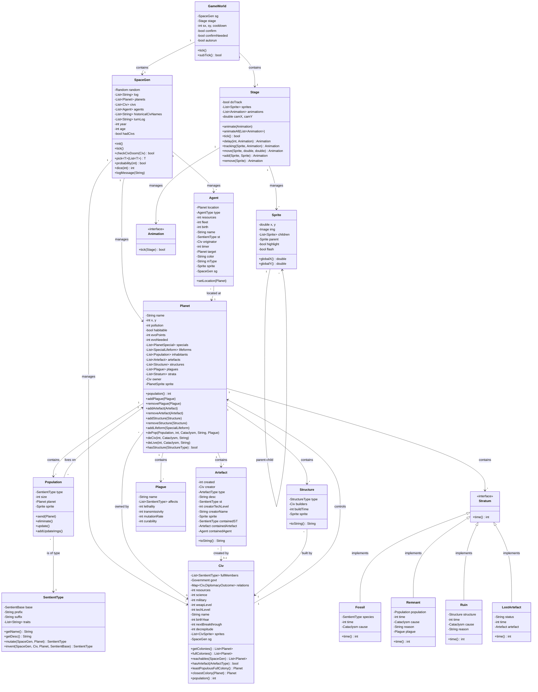

---

## Enumeration Diagrams

### Government System

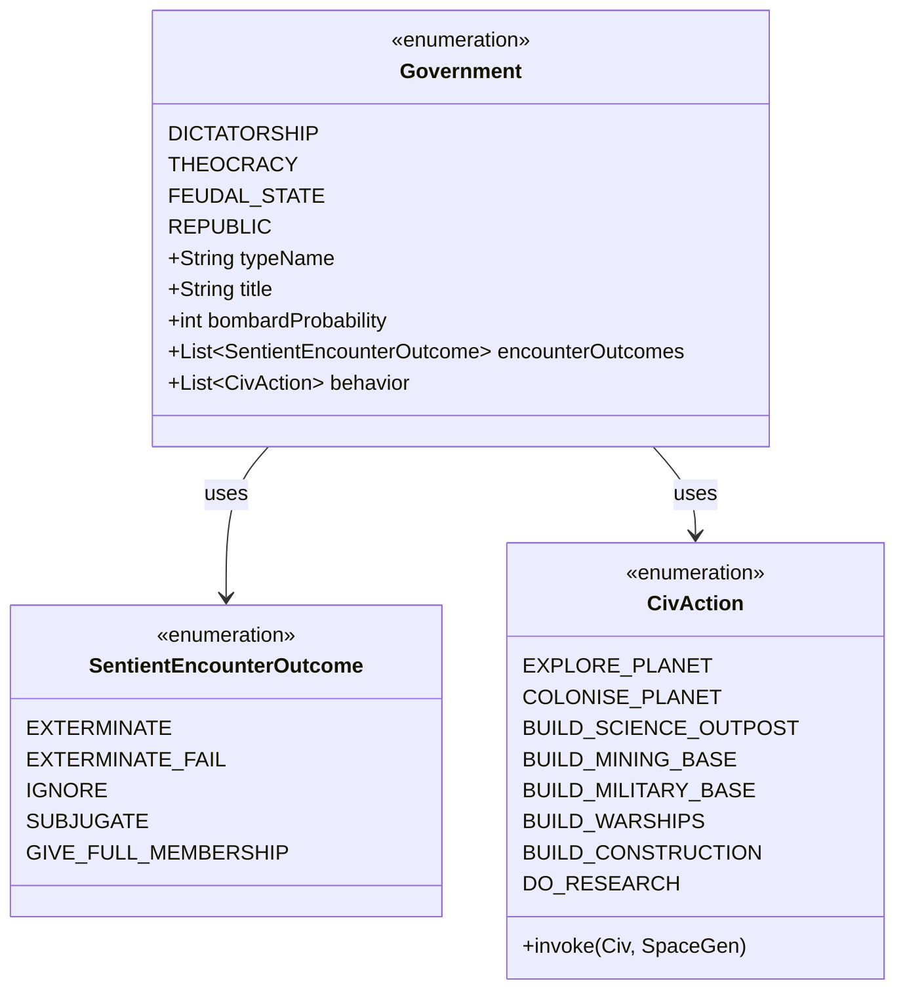

### Artefact System

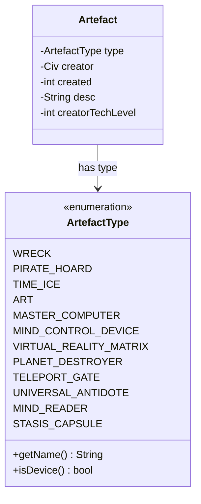

### Planet Features

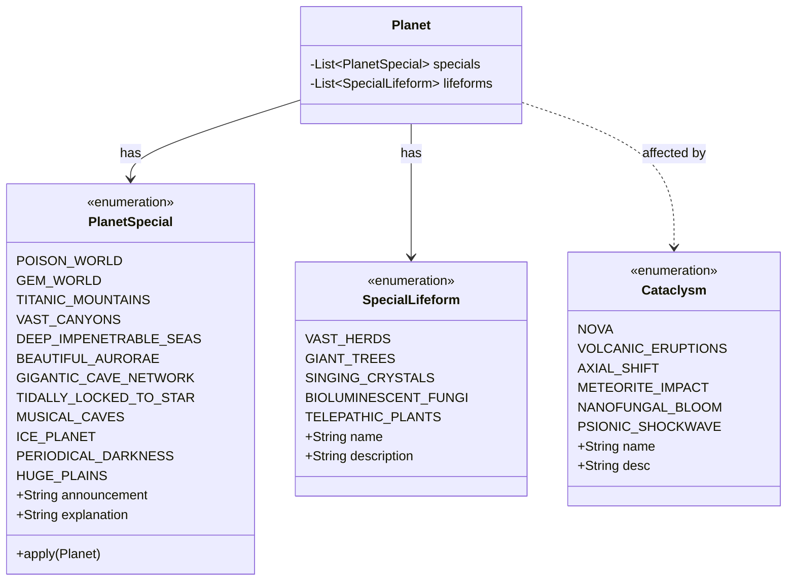

### Agent System

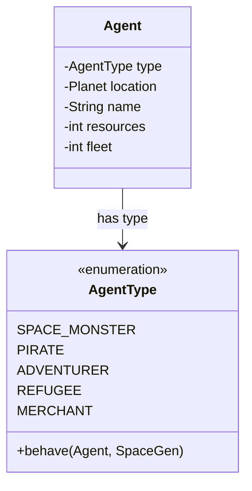

### Sentient Species System

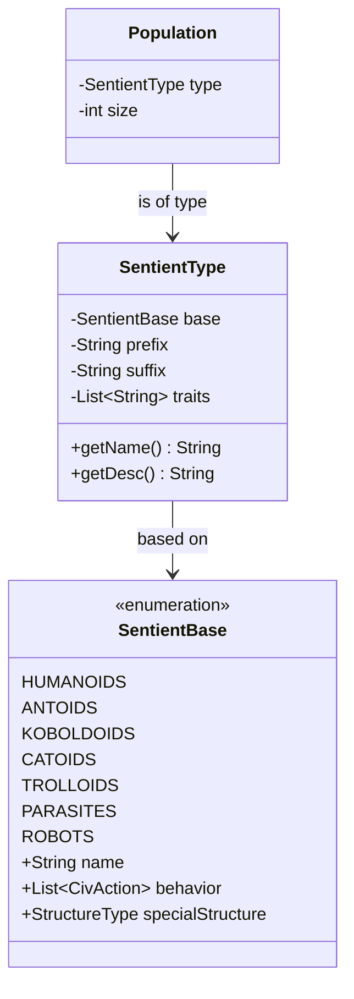

---

## Sequence Diagrams

### Game Initialization

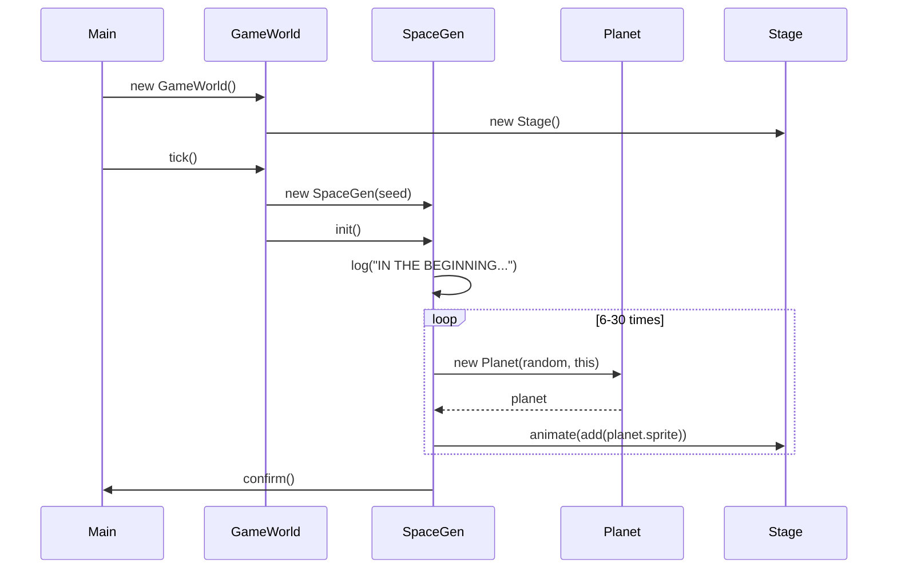

### Civilization Tick

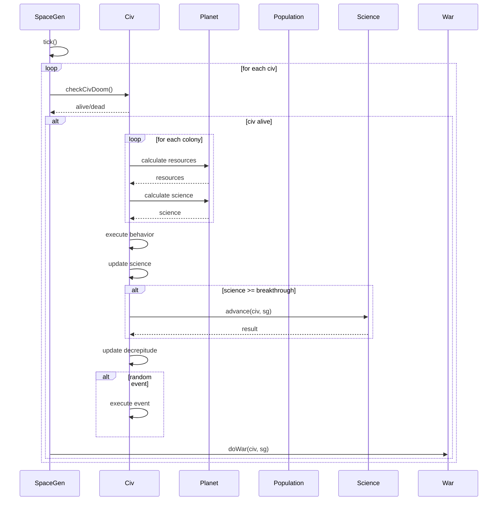

### Planet Evolution

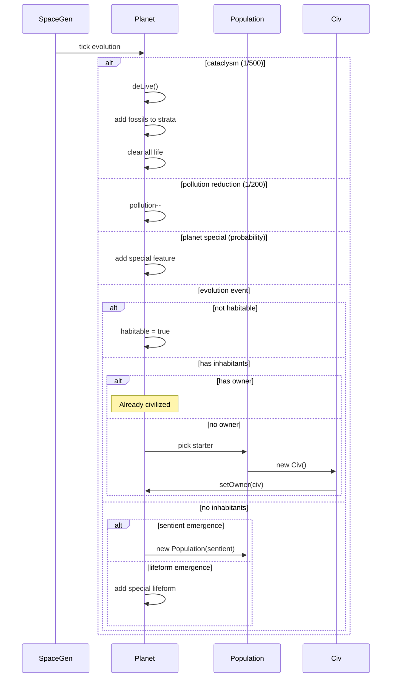

### War Resolution

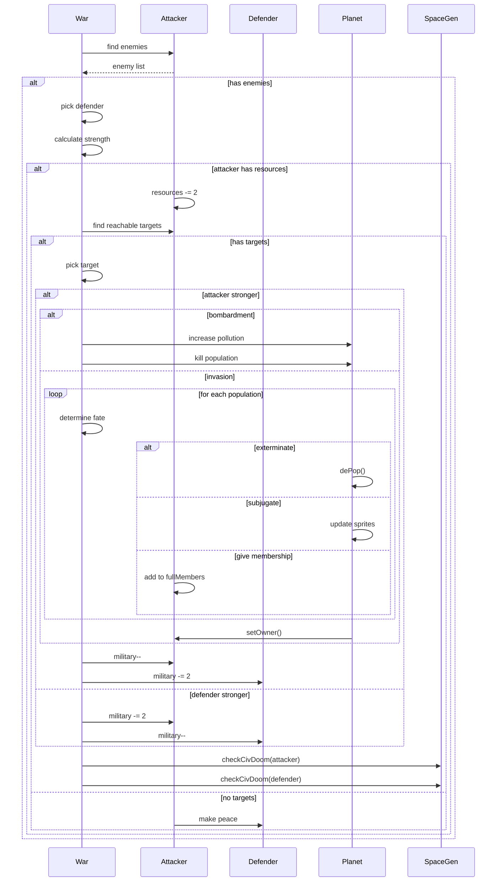

### Agent Behavior

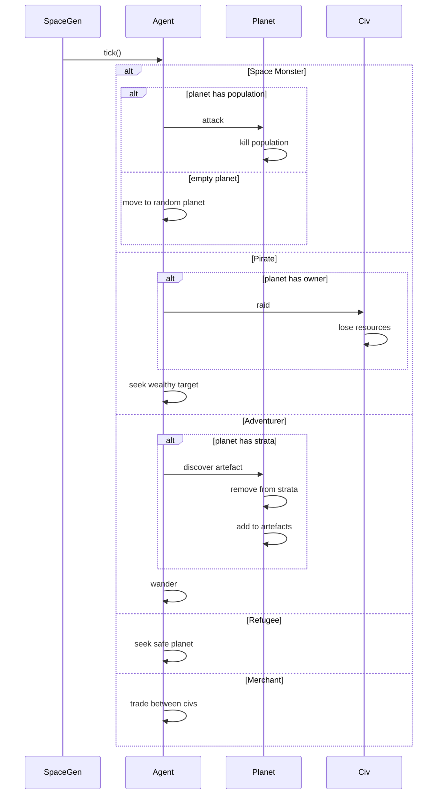

---

## State Machine Diagrams

### Civilization Lifecycle

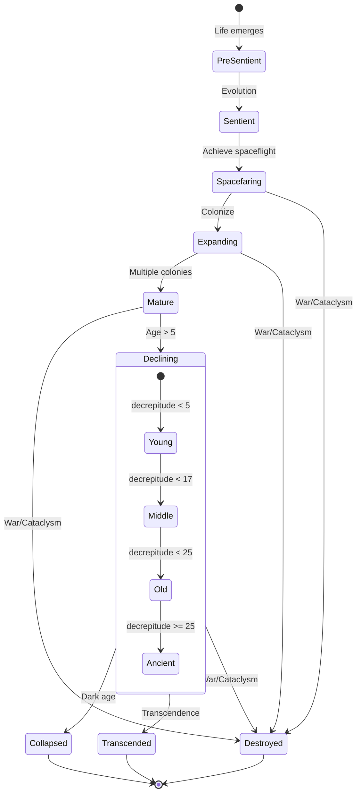

### Planet Lifecycle

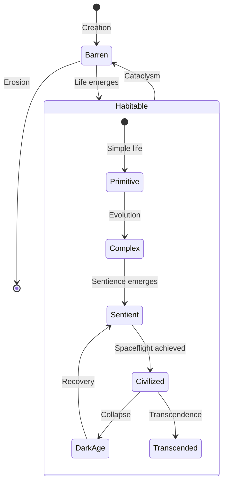

### Population Dynamics

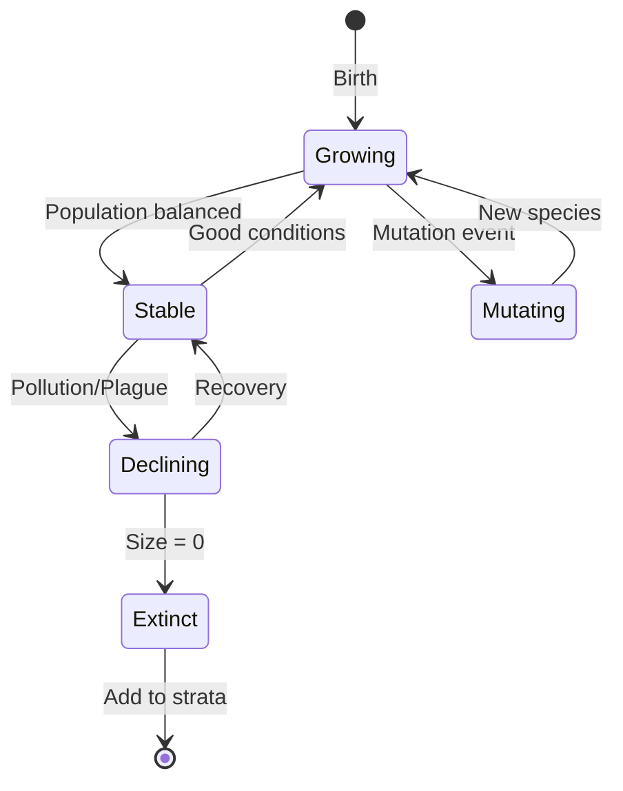

---

## Component Interaction Diagram

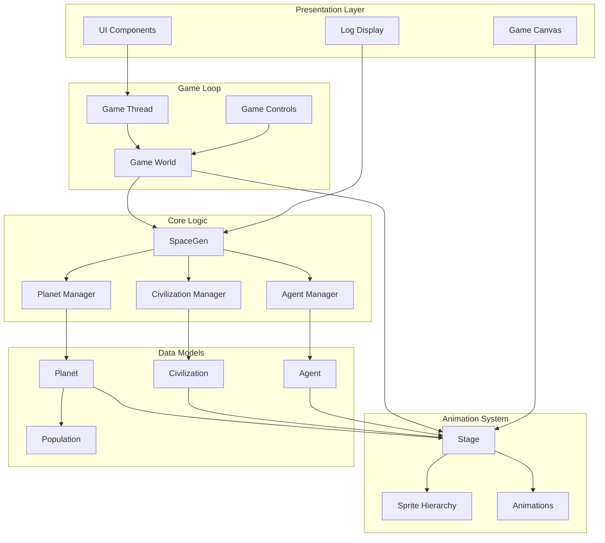

---

## Data Flow Diagram

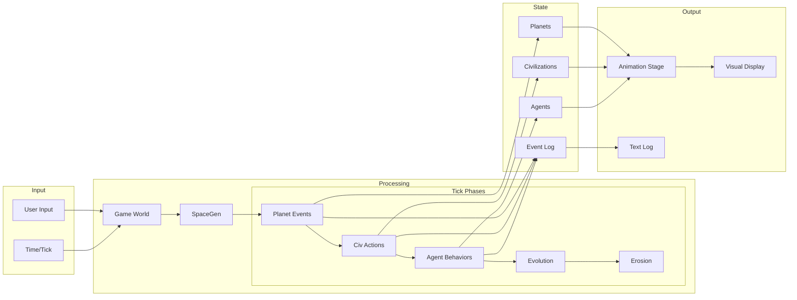

---

## Architecture Layers

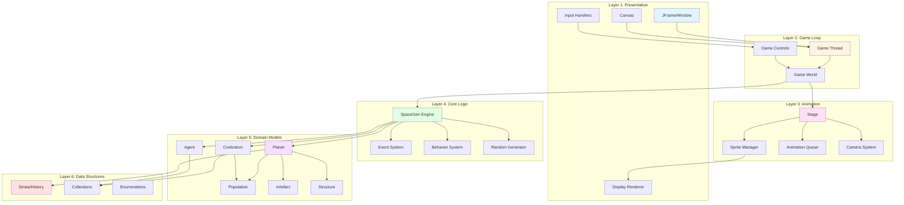

---

## Package Structure

```mermaid
graph TD
    Root[com.zarkonnen.spacegen]
    
    Root --> Core[core]
    Root --> Models[models]
    Root --> UI[ui]
    Root --> Logic[logic]
    Root --> Enums[enums]
    Root --> Utils[utils]
    
    Core --> SpaceGen[SpaceGen.java]
    Core --> GameWorld[GameWorld.java]
    Core --> GameThread[GameThread.java]
    
    Models --> Planet[Planet.java]
    Models --> Civ[Civ.java]
    Models --> Agent[Agent.java]
    Models --> Population[Population.java]
    Models --> Artefact[Artefact.java]
    Models --> Structure[Structure.java]
    Models --> Stratum[Stratum.java]
    
    UI --> Stage[Stage.java]
    UI --> Sprite[Sprite.java]
    UI --> GameDisplay[GameDisplay.java]
    UI --> Input[Input.java]
    
    Logic --> CivAction[CivAction.java]
    Logic --> CivEvents[CivEvents.java]
    Logic --> War[War.java]
    Logic --> Science[Science.java]
    Logic --> Diplomacy[Diplomacy.java]
    
    Enums --> Government[Government.java]
    Enums --> AgentType[AgentType.java]
    Enums --> ArtefactType[ArtefactType.java]
    Enums --> Cataclysm[Cataclysm.java]
    Enums --> PlanetSpecial[PlanetSpecial.java]
    
    Utils --> Names[Names.java]
    Utils --> Imager[Imager.java]
    Utils --> MediaProvider[MediaProvider.java]
```

---

## Flutter Package Structure (Recommended)

```mermaid
graph TD
    Root[lib/]
    
    Root --> Main[main.dart]
    Root --> Models[models/]
    Root --> Game[game/]
    Root --> Rendering[rendering/]
    Root --> Logic[logic/]
    Root --> UI[ui/]
    Root --> Providers[providers/]
    Root --> Utils[utils/]
    
    Models --> MSpaceGen[space_gen.dart]
    Models --> MPlanet[planet.dart]
    Models --> MCiv[civ.dart]
    Models --> MAgent[agent.dart]
    Models --> MEnums[enums/]
    
    MEnums --> EGovt[government.dart]
    MEnums --> EAgent[agent_type.dart]
    MEnums --> EArt[artefact_type.dart]
    
    Game --> GWorld[game_world.dart]
    Game --> GController[game_controller.dart]
    Game --> GState[game_state.dart]
    
    Rendering --> RStage[stage.dart]
    Rendering --> RSprite[sprite.dart]
    Rendering --> RAnims[animations/]
    Rendering --> RPainter[game_painter.dart]
    Rendering --> RImager[imager.dart]
    
    RAnims --> ADelay[delay.dart]
    RAnims --> AMove[move.dart]
    RAnims --> ATrack[tracking.dart]
    
    Logic --> LActions[civ_actions.dart]
    Logic --> LEvents[civ_events.dart]
    Logic --> LWar[war.dart]
    Logic --> LScience[science.dart]
    
    UI --> UScreens[screens/]
    UI --> UWidgets[widgets/]
    UI --> UTheme[theme.dart]
    
    UScreens --> SGame[game_screen.dart]
    UScreens --> SMenu[menu_screen.dart]
    
    UWidgets --> WCanvas[game_canvas.dart]
    UWidgets --> WLog[log_display.dart]
    UWidgets --> WInfo[info_panel.dart]
    
    Providers --> PSpaceGen[space_gen_provider.dart]
    
    Utils --> UNames[names.dart]
    Utils --> URandom[random_utils.dart]
    Utils --> UConst[constants.dart]
```

---

## Summary

These UML diagrams provide:

1. **Complete class relationships** showing all major components
2. **Enumeration systems** for game mechanics
3. **Sequence diagrams** for key processes
4. **State machines** for entity lifecycles
5. **Component interactions** showing data flow
6. **Architecture layers** showing system organization
7. **Package structures** for both Java and Flutter

Use these diagrams as reference when:
- Understanding system architecture
- Planning the Flutter conversion
- Documenting the codebase
- Onboarding new developers
- Debugging complex interactions
