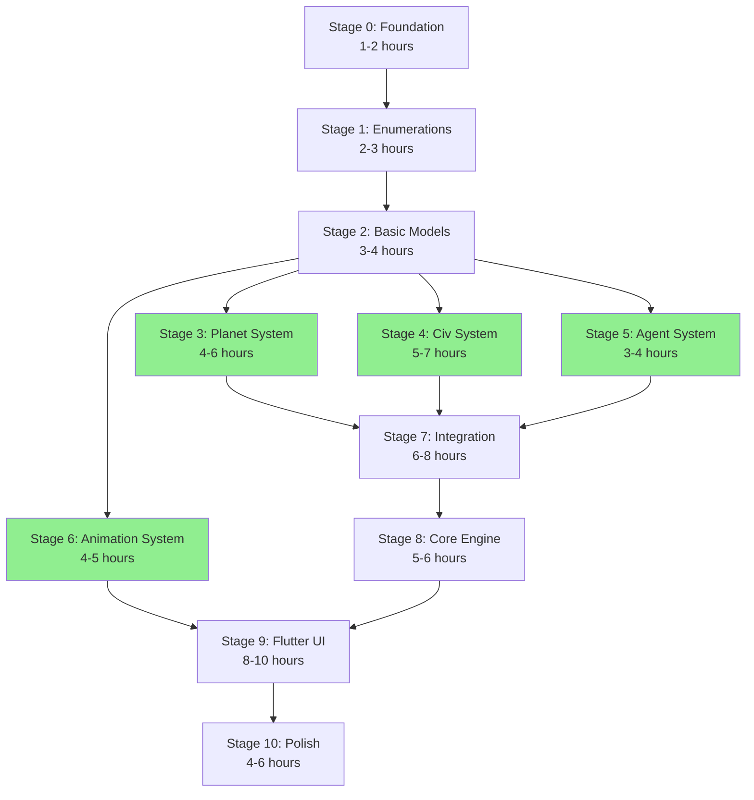

# SpaceGen Conversion - Visual Guide

## 🎯 Quick Answer to Your Question

**Q: Can we convert systems in separate stages?**

**A: YES! Absolutely!** Here's how:

```
┌─────────────────────────────────────────────────────────────┐
│  STAGED CONVERSION APPROACH                                 │
│                                                             │
│  Day 1-2: Foundation + Enumerations                        │
│  Day 3-4: Basic Models                                     │
│                                                             │
│  Then CHOOSE YOUR PATH:                                    │
│                                                             │
│  ┌──────────────┐  ┌──────────────┐  ┌──────────────┐    │
│  │   Planet     │  │     Civ      │  │    Agent     │    │
│  │   System     │  │   System     │  │   System     │    │
│  │  (4-6 hrs)   │  │  (5-7 hrs)   │  │  (3-4 hrs)   │    │
│  └──────────────┘  └──────────────┘  └──────────────┘    │
│         ↓                 ↓                 ↓              │
│         └─────────────────┴─────────────────┘              │
│                          ↓                                 │
│                  Integration Systems                       │
│                                                             │
└─────────────────────────────────────────────────────────────┘
```

---

## 📊 Conversion Stages Visualization

### Stage Dependencies



**Green boxes = Can be done in parallel!**

---

## 🗓️ Timeline Options

### Option 1: Solo Developer (Sequential)

```
Week 1: Foundation → Enumerations → Basic Models
        ████████████████████████████████

Week 2: Planet System → Civilization System
        ████████████████████████████████

Week 3: Agent System → Animation System → Integration
        ████████████████████████████████

Week 4: Core Engine → Flutter UI
        ████████████████████████████████

Week 5: Polish & Optimization
        ████████████████████████████████

Total: ~5 weeks (2-3 hours/day)
```

### Option 2: Team of 3 (Parallel)

```
Week 1: All: Foundation → Enumerations → Basic Models
        Dev A: ████████████████████████████████
        Dev B: ████████████████████████████████
        Dev C: ████████████████████████████████

Week 2: Parallel Development
        Dev A: Planet System ████████████████
        Dev B: Civ System ████████████████████
        Dev C: Agent + Animation ████████████████

Week 3: All: Integration → Core Engine
        Dev A: ████████████████████████████████
        Dev B: ████████████████████████████████
        Dev C: ████████████████████████████████

Week 4: All: Flutter UI → Polish
        Dev A: ████████████████████████████████
        Dev B: ████████████████████████████████
        Dev C: ████████████████████████████████

Total: ~4 weeks (full-time)
```

---

## 📁 Project Structure

```
SpaceGen/
│
├── 📄 Java Source Files (Original)
│   ├── SpaceGen.java
│   ├── Planet.java
│   ├── Civ.java
│   ├── Agent.java
│   └── ... (all other .java files)
│
├── 📚 Analysis Documentation (Complete)
│   ├── INDEX.md                    ← Start here for overview
│   ├── DESIGN_ANALYSIS.md          ← Deep technical analysis
│   ├── FLUTTER_CONVERSION_GUIDE.md ← Code examples
│   ├── UML_DIAGRAMS.md            ← Visual diagrams
│   └── README_SUMMARY.md          ← Quick reference
│
├── 📋 Conversion Documentation (NEW!)
│   └── doc/
│       ├── README.md                    ← Documentation guide
│       ├── STAGED_CONVERSION_PLAN.md    ← How to convert
│       ├── CONVERSION_STATUS.md         ← Track progress
│       ├── DART_QUICK_REFERENCE.md      ← Dart API reference
│       └── CONVERSION_SUMMARY.md        ← This summary
│
└── 🎯 Dart Project (NEW!)
    └── dart_conversion/
        ├── lib/
        │   ├── core/         ← Stage 8
        │   ├── models/       ← Stage 2, 3, 4, 5
        │   ├── enums/        ← Stage 1
        │   ├── systems/      ← Stage 3, 4, 5, 7
        │   ├── rendering/    ← Stage 6
        │   ├── ui/           ← Stage 9
        │   ├── providers/    ← Stage 9
        │   └── utils/        ← Stage 0
        └── test/             ← All stages
```

---

## 🎨 System Conversion Map

### What Gets Converted When

```
┌─────────────────────────────────────────────────────────────┐
│ STAGE 0: FOUNDATION                                         │
│ ┌─────────────────────────────────────────────────────────┐ │
│ │ • RandomUtils    • Constants                            │ │
│ │ • NameGenerator  • GameLogger                           │ │
│ └─────────────────────────────────────────────────────────┘ │
└─────────────────────────────────────────────────────────────┘

┌─────────────────────────────────────────────────────────────┐
│ STAGE 1: ENUMERATIONS                                       │
│ ┌─────────────────────────────────────────────────────────┐ │
│ │ Government.java        → government.dart                │ │
│ │ AgentType.java         → agent_type.dart                │ │
│ │ ArtefactType.java      → artefact_type.dart             │ │
│ │ Cataclysm.java         → cataclysm.dart                 │ │
│ │ PlanetSpecial.java     → planet_special.dart            │ │
│ │ SpecialLifeform.java   → special_lifeform.dart          │ │
│ │ StructureType.java     → structure_type.dart            │ │
│ │ ... and more                                            │ │
│ └─────────────────────────────────────────────────────────┘ │
└─────────────────────────────────────────────────────────────┘

┌─────────────────────────────────────────────────────────────┐
│ STAGE 2: BASIC MODELS                                       │
│ ┌─────────────────────────────────────────────────────────┐ │
│ │ Planet.java            → planet.dart (properties)       │ │
│ │ Civ.java               → civilization.dart (properties) │ │
│ │ Agent.java             → agent.dart (properties)        │ │
│ │ Population.java        → population.dart                │ │
│ │ Artefact.java          → artefact.dart                  │ │
│ │ Structure.java         → structure.dart                 │ │
│ │ Stratum.java + impls   → strata/ (all)                  │ │
│ └─────────────────────────────────────────────────────────┘ │
└─────────────────────────────────────────────────────────────┘

┌──────────────────────────────────────────────────────────────┐
│ STAGE 3: PLANET SYSTEM (Can do in parallel with 4, 5, 6)   │
│ ┌────────────────────────────────────────────────────────┐  │
│ │ Planet.java (complete) → planet.dart (complete)        │  │
│ │ + PlanetEvolution system                               │  │
│ │ + PlanetEvents system                                  │  │
│ │ + Evolution logic                                      │  │
│ │ + Cataclysm handling                                   │  │
│ │ + Strata management                                    │  │
│ └────────────────────────────────────────────────────────┘  │
└──────────────────────────────────────────────────────────────┘

┌──────────────────────────────────────────────────────────────┐
│ STAGE 4: CIV SYSTEM (Can do in parallel with 3, 5, 6)      │
│ ┌────────────────────────────────────────────────────────┐  │
│ │ Civ.java (complete)    → civilization.dart (complete)  │  │
│ │ + CivResources system                                  │  │
│ │ + CivScience system                                    │  │
│ │ + CivBehaviors system                                  │  │
│ │ + CivEvents system                                     │  │
│ │ + Government behaviors                                 │  │
│ │ + Decrepitude system                                   │  │
│ └────────────────────────────────────────────────────────┘  │
└──────────────────────────────────────────────────────────────┘

┌──────────────────────────────────────────────────────────────┐
│ STAGE 5: AGENT SYSTEM (Can do in parallel with 3, 4, 6)    │
│ ┌────────────────────────────────────────────────────────┐  │
│ │ Agent.java (complete)  → agent.dart (complete)         │  │
│ │ + AgentBehaviors system                                │  │
│ │ + Space Monster behavior                               │  │
│ │ + Pirate behavior                                      │  │
│ │ + Adventurer behavior                                  │  │
│ │ + Refugee behavior                                     │  │
│ │ + Merchant behavior                                    │  │
│ └────────────────────────────────────────────────────────┘  │
└──────────────────────────────────────────────────────────────┘

┌──────────────────────────────────────────────────────────────┐
│ STAGE 6: ANIMATION (Can do in parallel with 3, 4, 5)       │
│ ┌────────────────────────────────────────────────────────┐  │
│ │ Stage.java             → stage.dart                    │  │
│ │ Sprite.java            → sprite.dart                   │  │
│ │ Animation classes      → animations/ (all)             │  │
│ │ + Camera system                                        │  │
│ │ + Sprite hierarchy                                     │  │
│ │ + Animation queue                                      │  │
│ │ (Headless - no rendering yet)                          │  │
│ └────────────────────────────────────────────────────────┘  │
└──────────────────────────────────────────────────────────────┘

┌─────────────────────────────────────────────────────────────┐
│ STAGE 7: INTEGRATION SYSTEMS                                │
│ ┌─────────────────────────────────────────────────────────┐ │
│ │ War.java               → war_system.dart                │ │
│ │ Diplomacy.java         → diplomacy_system.dart          │ │
│ │ Science.java           → science_system.dart            │ │
│ │ + Integration manager                                   │ │
│ │ + System integration tests                              │ │
│ └─────────────────────────────────────────────────────────┘ │
└─────────────────────────────────────────────────────────────┘

┌─────────────────────────────────────────────────────────────┐
│ STAGE 8: CORE ENGINE                                        │
│ ┌─────────────────────────────────────────────────────────┐ │
│ │ SpaceGen.java          → space_gen.dart                 │ │
│ │ + GameState                                             │ │
│ │ + TickProcessor                                         │ │
│ │ + Full system integration                               │ │
│ │ (Headless simulation complete!)                         │ │
│ └─────────────────────────────────────────────────────────┘ │
└─────────────────────────────────────────────────────────────┘

┌─────────────────────────────────────────────────────────────┐
│ STAGE 9: FLUTTER UI                                         │
│ ┌─────────────────────────────────────────────────────────┐ │
│ │ Main.java              → main.dart                      │ │
│ │ GameWorld.java         → game_screen.dart               │ │
│ │ GameDisplay.java       → game_canvas.dart               │ │
│ │ GameControls.java      → control_panel.dart             │ │
│ │ + SpaceGenProvider (state management)                   │ │
│ │ + GamePainter (rendering)                               │ │
│ │ + UI widgets                                            │ │
│ │ (Full app complete!)                                    │ │
│ └─────────────────────────────────────────────────────────┘ │
└─────────────────────────────────────────────────────────────┘

┌─────────────────────────────────────────────────────────────┐
│ STAGE 10: POLISH & OPTIMIZATION                             │
│ ┌─────────────────────────────────────────────────────────┐ │
│ │ • Performance profiling                                 │ │
│ │ • Rendering optimization                                │ │
│ │ • Viewport culling                                      │ │
│ │ • Memory leak fixes                                     │ │
│ │ • Loading screens                                       │ │
│ │ • Transitions                                           │ │
│ │ • Final testing                                         │ │
│ └─────────────────────────────────────────────────────────┘ │
└─────────────────────────────────────────────────────────────┘
```

---

## 🔄 Animation System Throughout

You asked specifically about the Animation System:

```
┌─────────────────────────────────────────────────────────────┐
│ ANIMATION SYSTEM: TWO-PHASE APPROACH                        │
│                                                             │
│ PHASE 1: STAGE 6 (Week 2)                                  │
│ ┌─────────────────────────────────────────────────────────┐ │
│ │ Headless Implementation                                 │ │
│ │ • Sprite class (data only)                              │ │
│ │ • Stage class (logic only)                              │ │
│ │ │ • All animation types                                  │ │
│ │ • Camera system                                         │ │
│ │ • Animation queue                                       │ │
│ │ • Fully testable without UI                             │ │
│ └─────────────────────────────────────────────────────────┘ │
│                          ↓                                  │
│ PHASE 2: STAGE 9 (Week 4)                                  │
│ ┌─────────────────────────────────────────────────────────┐ │
│ │ Flutter Integration                                     │ │
│ │ • CustomPainter for rendering                           │ │
│ │ • Sprite rendering                                      │ │
│ │ • Animation rendering                                   │ │
│ │ • Camera controls                                       │ │
│ │ • Visual feedback                                       │ │
│ └─────────────────────────────────────────────────────────┘ │
└─────────────────────────────────────────────────────────────┘
```

**Key Point**: Animation logic is built **separately** from rendering, then integrated later!

---

## 📈 Progress Tracking

### The Status Document

`doc/CONVERSION_STATUS.md` shows exactly where you are:

```
┌─────────────────────────────────────────────────────────────┐
│ CONVERSION STATUS                                           │
├─────────────────────────────────────────────────────────────┤
│ Stage 0: Foundation        🟢 Complete   100%  12/12  95%  │
│ Stage 1: Enumerations      🟡 In Progress 60%   8/12  80%  │
│ Stage 2: Basic Models      🔴 Not Started 0%    0/0   N/A  │
│ Stage 3: Planet System     🔴 Not Started 0%    0/0   N/A  │
│ Stage 4: Civ System        🔴 Not Started 0%    0/0   N/A  │
│ Stage 5: Agent System      🔴 Not Started 0%    0/0   N/A  │
│ Stage 6: Animation System  🔴 Not Started 0%    0/0   N/A  │
│ Stage 7: Integration       🔴 Not Started 0%    0/0   N/A  │
│ Stage 8: Core Engine       🔴 Not Started 0%    0/0   N/A  │
│ Stage 9: Flutter UI        🔴 Not Started 0%    0/0   N/A  │
│ Stage 10: Polish           🔴 Not Started 0%    0/0   N/A  │
├─────────────────────────────────────────────────────────────┤
│ Overall Progress: 10% (1/10 stages complete)               │
└─────────────────────────────────────────────────────────────┘

Legend:
🔴 Not Started  🟡 In Progress  🟢 Complete  🔵 Testing  ⚪ Blocked
```

---

## 🎯 Your Workflow

### Daily Workflow

```
┌─────────────────────────────────────────────────────────────┐
│ MORNING                                                     │
│ 1. Check doc/CONVERSION_STATUS.md                          │
│ 2. Pick next uncompleted task                              │
│ 3. Review doc/STAGED_CONVERSION_PLAN.md for details        │
│ 4. Check FLUTTER_CONVERSION_GUIDE.md for examples          │
└─────────────────────────────────────────────────────────────┘
                          ↓
┌─────────────────────────────────────────────────────────────┐
│ DURING WORK                                                 │
│ 1. Implement code                                           │
│ 2. Write tests                                              │
│ 3. Run tests (flutter test)                                │
│ 4. Check tasks off in CONVERSION_STATUS.md                 │
└─────────────────────────────────────────────────────────────┘
                          ↓
┌─────────────────────────────────────────────────────────────┐
│ END OF DAY                                                  │
│ 1. Update doc/CONVERSION_STATUS.md                         │
│    • Mark completed tasks                                   │
│    • Update progress percentages                            │
│    • Document any issues                                    │
│ 2. Update doc/DART_QUICK_REFERENCE.md (if APIs changed)   │
│ 3. Commit code + documentation together                     │
└─────────────────────────────────────────────────────────────┘
```

---

## 📚 Documentation Quick Reference

### Which Document When?

```
┌─────────────────────────────────────────────────────────────┐
│ UNDERSTANDING THE SYSTEM                                    │
│ • README_SUMMARY.md          → Quick overview              │
│ • UML_DIAGRAMS.md            → Visual diagrams             │
│ • DESIGN_ANALYSIS.md         → Deep technical details      │
└─────────────────────────────────────────────────────────────┘

┌─────────────────────────────────────────────────────────────┐
│ PLANNING THE CONVERSION                                     │
│ • doc/STAGED_CONVERSION_PLAN.md  → How to convert          │
│ • doc/CONVERSION_SUMMARY.md      → Overview & approach     │
│ • FLUTTER_CONVERSION_GUIDE.md    → Code examples           │
└─────────────────────────────────────────────────────────────┘

┌─────────────────────────────────────────────────────────────┐
│ DURING CONVERSION                                           │
│ • doc/CONVERSION_STATUS.md       → Track progress          │
│ • doc/STAGED_CONVERSION_PLAN.md  → Stage details           │
│ • FLUTTER_CONVERSION_GUIDE.md    → Code examples           │
│ • doc/DART_QUICK_REFERENCE.md    → API reference           │
└─────────────────────────────────────────────────────────────┘

┌─────────────────────────────────────────────────────────────┐
│ WORKING WITH DART CODE                                      │
│ • doc/DART_QUICK_REFERENCE.md    → API reference           │
│ • doc/CONVERSION_STATUS.md       → What's implemented      │
│ • FLUTTER_CONVERSION_GUIDE.md    → Patterns & examples     │
└─────────────────────────────────────────────────────────────┘
```

---

## 🎉 Key Takeaways

### ✅ YES, You Can Convert in Stages!

1. **Planet System** - Can be done independently (Stage 3)
2. **Civilization System** - Can be done independently (Stage 4)
3. **Agent System** - Can be done independently (Stage 5)
4. **Animation System** - Can be done independently (Stage 6)

All four can be done **in parallel** after Stage 2!

### ✅ Animation Throughout

- **Stage 6**: Build animation logic (headless)
- **Stage 9**: Add Flutter rendering

### ✅ Complete Tracking

- `doc/CONVERSION_STATUS.md` - Always know where you are
- `doc/DART_QUICK_REFERENCE.md` - Always know what's implemented

### ✅ Flexible Timeline

- Work at your own pace
- Take breaks between stages
- Multiple developers can work in parallel

---

## 🚀 Ready to Start?

### Step 1: Read the Plan
```bash
open doc/STAGED_CONVERSION_PLAN.md
```

### Step 2: Check the Status
```bash
open doc/CONVERSION_STATUS.md
```

### Step 3: Begin Stage 0
```bash
cd dart_conversion
# Create pubspec.yaml
# Implement utilities
# Write tests
```

### Step 4: Update Status
```bash
# Mark tasks complete in doc/CONVERSION_STATUS.md
```

### Step 5: Keep Going!
```bash
# One stage at a time
# One system at a time
# You've got this! 🎉
```

---

## 📞 Need Help?

### Quick Links

- **Overview**: [doc/CONVERSION_SUMMARY.md](CONVERSION_SUMMARY.md)
- **Plan**: [doc/STAGED_CONVERSION_PLAN.md](STAGED_CONVERSION_PLAN.md)
- **Status**: [doc/CONVERSION_STATUS.md](CONVERSION_STATUS.md)
- **API**: [doc/DART_QUICK_REFERENCE.md](DART_QUICK_REFERENCE.md)
- **Examples**: [FLUTTER_CONVERSION_GUIDE.md](../FLUTTER_CONVERSION_GUIDE.md)
- **Analysis**: [DESIGN_ANALYSIS.md](../DESIGN_ANALYSIS.md)

---

*This visual guide provides a quick overview of the staged conversion approach. For detailed information, see the individual documentation files.*
